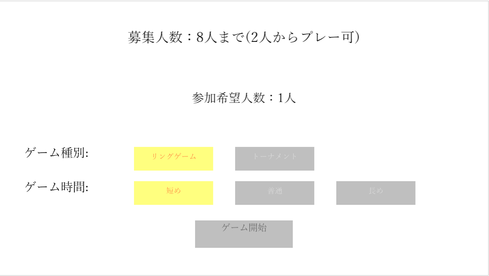
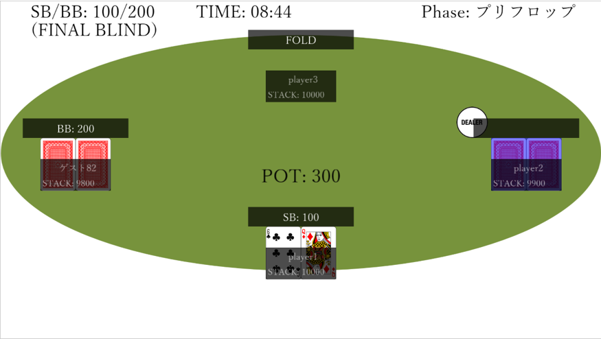
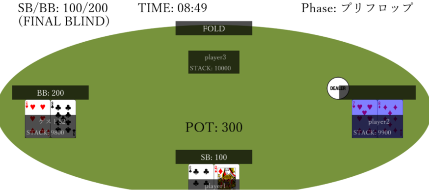
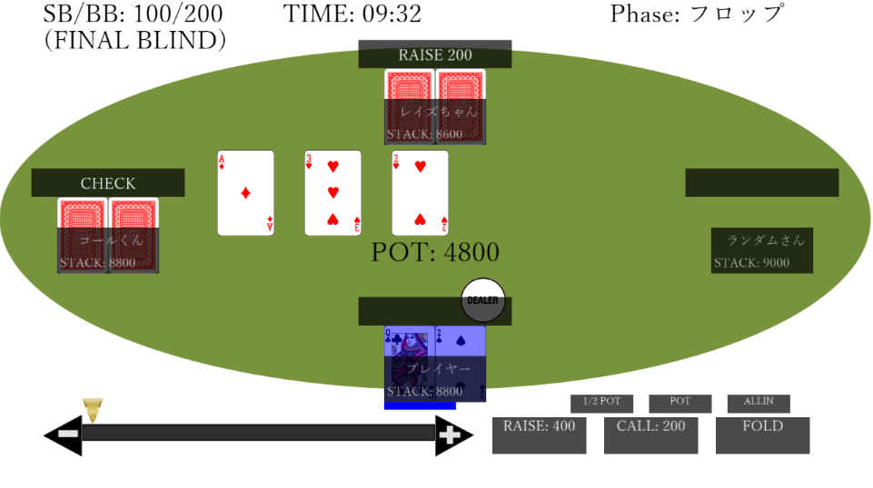

# テキサスホールデム

## 概要

[ゲームアツマール](https://game.nicovideo.jp/atsumaru/)と[ニコ生](https://live.nicovideo.jp/)で動作するテキサスホールデムゲームです。
テキサスホールデムのルールや役については以下のページを参照してください

- テキサスホールデムのルール：https://ja.wikipedia.org/wiki/%E3%83%86%E3%82%AD%E3%82%B5%E3%82%B9%E3%83%BB%E3%83%9B%E3%83%BC%E3%83%AB%E3%83%87%E3%83%A0
- ポーカーの役の強さ：https://ja.wikipedia.org/wiki/%E3%83%9D%E3%83%BC%E3%82%AB%E3%83%BC%E3%83%BB%E3%83%8F%E3%83%B3%E3%83%89%E3%81%AE%E4%B8%80%E8%A6%A7

### ニコ生での動作
- 配信者側でゲームの種類(リングゲームorトーナメント)やゲーム時間の長さを設定することができます
  - 
- プレイヤー側と視聴者側でゲームの見え方が変わります
  - プレイヤー視点
    - 
  - 視聴者視点
    - 

### ゲームアツマールでの動作
- CPUとの10分間のリングゲームが始まります


## ビルドと実行方法

TypeScriptで作られています。以下のコマンドで、このリポジトリをクローンしてビルドしてください。

```
git clone git@github.com:akc29/poker-for-niconama.git
cd poker-for-niconama
npm install
npm run build
```

以下のコマンドで akashic-cli-serve が起動されます。実行後、 `http://localhost:3300/` にアクセスしてください。

```
npm start
```

上記コマンドではニコ生上での動作と同様に動作します。ゲームアツマール上と同様に動作させたい場合は以下のコマンドを実行します。

```
npm run start:atsumaru
```
